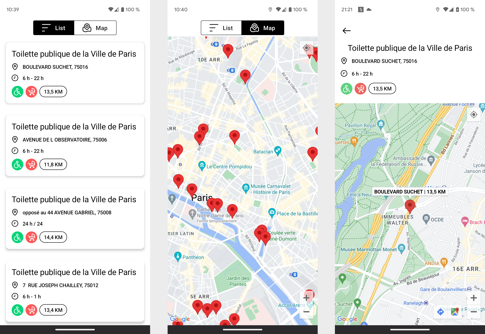

# Toilet App Test Android (RATP SMART SYSTEMS)

Le test technique android officiel de RATP Smart Systems pour intégrer les équipes des applications
Mappy et Bonjour RATP. Réalisé par Sami Essid, 18 Décember 2023.

### Source de données

`GET`: https://data.ratp.fr/api/records/1.0/search/?dataset=sanisettesparis2011&start=0&rows=1000

*Documentation*: https://data.ratp.fr/explore/dataset/sanisettesparis2011/information/

### Toilet App

Pour ce test technique, j'ai mis en place:
- La liste des toilettes avec ses informations (L'addresse, les heures d'ouvertures, l'accessibilité pour les personnes à mobilité réduite et La distance depuis votre position actuelle)
- La liste des toilettes dans une carte.
- Les détails des toilettes dans un autre écran.

Notre application se compose de trois écrans:

Notre application se compose de trois modules:

* __Domain: Business Logic Layer__: Est le responsable de la logique métier. Il contient les usecase
* __Data: Data Access Layer__: Il contient les models, les mapper, la définition des API réseau et
  implémente les interfaces exposées par le domaine.
* __App: Presentation Layer__: Est responsable de la présentation des données et de l'interaction
  avec Android Framework.

Pour développer notre application, nous avons utilisé les bibliothèques suivantes:

* __Hilt__: Pour l'injection de dépendances.
* __Navigation Compose__: Pour la navigation entre les screens.
* __Coroutines__: Pour exécuter notre code de manière asynchrone. Nous avons utilisé des coroutines
  pour assurer la communication entre nos vues et nos viewModels.
* __JUnit4__: Pour nos tests unitaires.
* __Mockito__: Pour le mock dans le tests unitaires.

__Avec plus de temps disponible__:

* Accès hors ligne.

Toute remarque constructive lors de la review et tout conseil pour implémenter les améliorations, l'architecture,... seront les bienvenus :)

